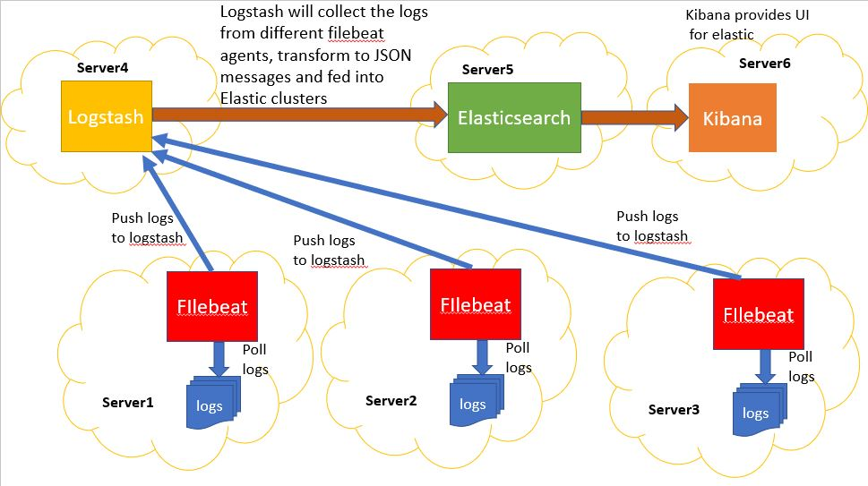

# logzio-orb Orb    

Utilize this orb to easily add Logz.io to your CI/CD pipeline. This orb collects data from a job and sends its logs to Logz.io

## Usage

TODO

## Design

Started from https://github.com/gravitee-lab/GraviteeReleaseOrchestrator/issues/8

* `Elasticsearch`, `Logstash`, and `Filebeat` to collect, and index logs into `Elasticsearch`.
* A `Kibana` dashboard for logs
* It's like the standard stack for log management with Elastic Stack

Architecture (below there, everywhere there is a filebeat, this is a Circle CI pipeline Execution) :

Note : Grafana `loki` cannot fit in, beacause loki will try and hit "Inside the CircleCI pipeline", not possible.

## Resources

The reference offical Elastic Stack full tutorial, with links to free hosted `Elasticsearch`, regarding fully hosted solution proposal :
* https://www.elastic.co/guide/en/beats/filebeat/7.8/filebeat-getting-started.html

Main steps :

* Step 1: Install `Filebeat` : this will be dockeried, run into circle ci pipeline
* Step 2: Configure `Filebeat` : this will into circle ci pipeline
* Step 3: Load the index template in Elasticsearch : that's gonna be outside `Circle CI` pipelines, within the `Elasticsearch` / `Logstash` (groks there) / `Kibana` stack, whether hosted or on prem
* Step 4: Set up the `Kibana` dashboards: that's gonna be outside `Circle CI` pipelines, within the `Elasticsearch` / `Logstash` (groks there) / `Kibana` stack, whether hosted or on prem
* Step 5: Start `Filebeat` : this will into circle ci pipeline
* Step 6: View the sample `Kibana` dashboards : that's gonna be outside `Circle CI` pipelines, within the `Elasticsearch` / `Logstash` (groks there) / `Kibana` stack, whether hosted or on prem
* more : => Quick start: modules for common log formats

There is no logstacsh tehre, consider what it would take to ad it, and what are the main market `Logstash` SAAS Offers

A few curiosities :
* https://logz.io/blog/Filebeat-tutorial/ : quick config for several logstash instances
* https://www.javainuse.com/elasticsearch/Filebeat-elk
* https://medium.com/@jaiprksh57/how-to-monitor-your-service-and-infrstructure-using-elk-with-grafana-ddc427aad7cc

## How to contribute

TODO

<!--
We welcome [issues](https://github.com/logzio/logzio-orb/issues) to and [pull requests](https://github.com/logzio/logzio-orb/pulls) against this repository!

To publish a new production version:
* Create a PR to the `Alpha` branch with your changes. This will act as a "staging" branch.
* When ready to publish a new production version, create a PR from `Alpha` to `master`. The Git Subject should include `[semver:patch|minor|release|skip]` to indicate the type of release.
* On merge, the release will be published to the orb registry automatically.

For further questions/comments about this or other orbs, visit the Orb Category of [CircleCI Discuss](https://discuss.circleci.com/c/orbs).
-->

## Change log

<!--
* 1.0.1 - add tests
* 1.0.0 - First version
-->
